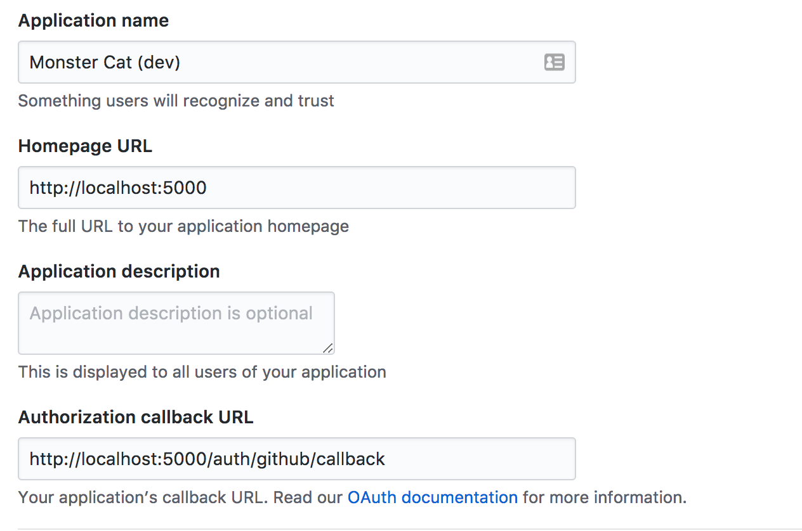

[](https://circleci.com/gh/dearshrewdwit/monster_cat)
# MonsterCat

MonsterCat is a tool I use at Makers Academy to help record feedback.

## Github Auth

 make sure to [register an application](https://github.com/settings/developers)


_Important:_ choose the port, but ensure the callback path is the same shown above.

Take a note of the keys given.
Create a `.env` file at the root of your directory.

```bash
# project root
> touch .env
```

Add your client id and secret like this:

```sh
# .env
GITHUB_CLIENT_ID=345lots_of_numbers34534
GITHUB_CLIENT_SECRET=345325234lots_more_of_numbers34533452344
```


## Development
```sh
> git clone https://github.com/dearshrewdwit/monster_cat.git
> cd monster_cat
> bundle install
> bin/rake db:setup
> bin/rake db:migrate
> bin/rails server
```
## Test
```sh
# root directory
> bundle exec rspec # to run all tests
> bundle exec rspec spec/path/to/spec # to run a single spec
```

## Production
https://monster-cat.herokuapp.com/

## Workflow

https://trello.com/b/4yX2CUCj/monster-cat
